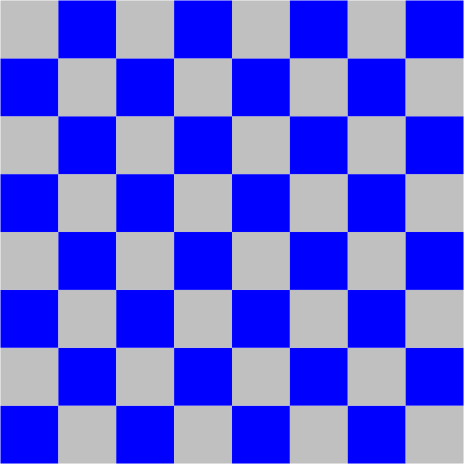
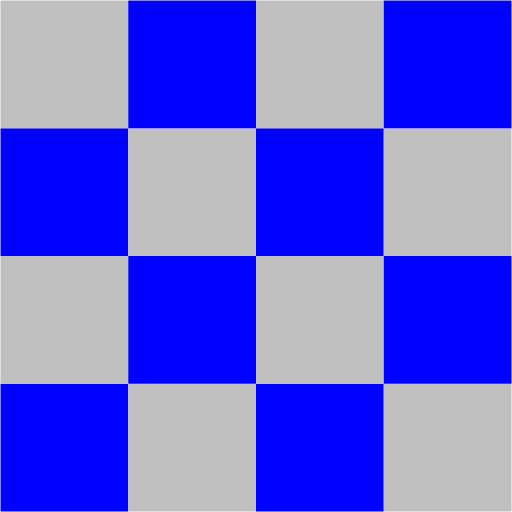
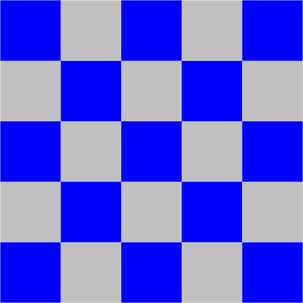

# Checkerboard Visualizer

8x8, 4x4, 5x5 Checkerboard Examples


<blockquote>
<pre class = "terminal">
<span class = prompt>~/Desktop/io&gt;</span> <span class = command>javac-introcs Checkerboard.java</span>

<span class = prompt>~/Desktop/io&gt;</span> <span class = command>java-introcs Checkerboard 8</span>




<span class = prompt>~/Desktop/io&gt;</span> <span class = command>java-introcs Checkerboard 4</span>




<span class = prompt>~/Desktop/io&gt;</span> <span class = command>java-introcs Checkerboard 5</span>


</pre>
</blockquote>

A Java program that generates perfect n×n checkerboard patterns using standard drawing.

## **Pattern Specifications**
- Bottom-left square always blue
- Alternating blue and light gray squares
- Perfectly fitted to drawing canvas
- Maintains square proportions at any size

## **Usage**
1. **Compile** the program:
   ```bash
   javac Checkerboard.java
   ```
2. **Run** with integer argument:
   ```bash
   java Checkerboard n
   ```
   - `n`: Grid dimension (positive integer)

## **Examples**
```bash
$ java Checkerboard 8
# Creates 8×8 checkerboard

$ java Checkerboard 5
# Creates 5×5 checkerboard
```

## **Implementation Details**
- Uses `StdDraw.setScale(0, n)` for proper coordinates
- Implements `StdDraw.filledSquare()` for rendering
- Color selection logic:
  ```java
  if ((i + j) % 2 == 0) {
      StdDraw.setColor(StdDraw.BLUE);
  } else {
      StdDraw.setColor(StdDraw.LIGHT_GRAY);
  }
  ```
- Maintains square aspect ratio automatically

## **Visual Properties**
- Blue squares: RGB (0, 0, 255)
- Light gray squares: RGB (200, 200, 200)
- Seamless edges between squares
- Canvas size remains constant (default 512×512)

## **Applications**
- Computer graphics demonstrations
- Game board visualizations
- Graphical algorithm testing
- Educational visualization tool
